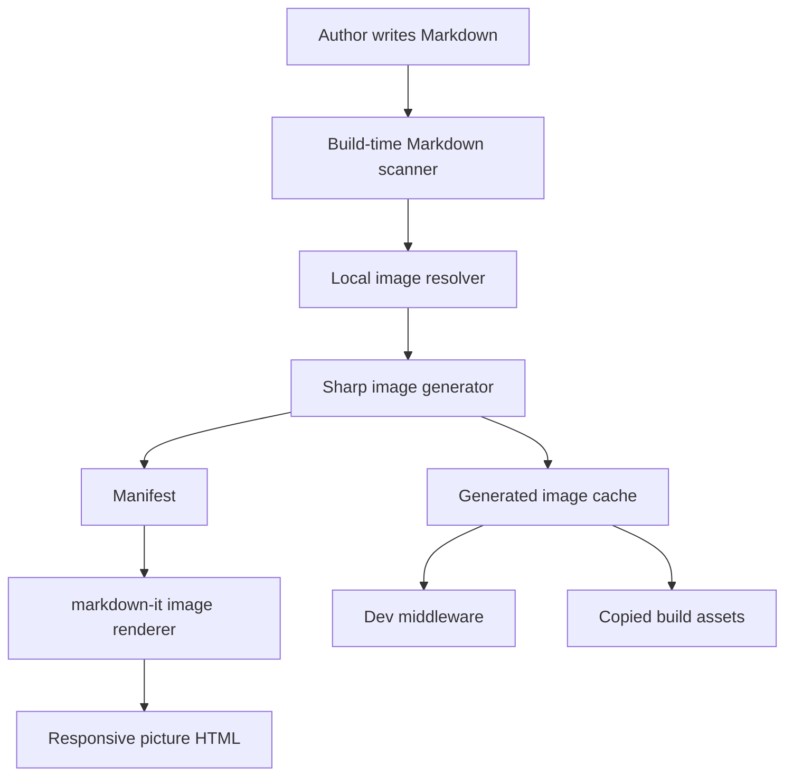

# Development Guide

This document is the implementation handoff for Cursor agents working on `vitepress-plugin-responsive-images`.

## Product Goal

Build a VitePress plugin that lets authors keep writing normal Markdown image syntax while build-time tooling generates responsive image variants and rewrites local Markdown images into `<picture>` markup.

The project must be globally usable. All repository content, code comments, docs, examples, issue templates, release notes, and package metadata must be written in English.

## Non-Negotiable Requirements

- Support VitePress `1.6.x` and `2.0.x` from one package.
- Treat VitePress `1.6.x` as stable supported.
- Treat VitePress `2.0.x` as supported and continuously tested, with alpha caveats until VitePress 2 is stable.
- Do not rely on VitePress internal APIs.
- Do not do async image work inside the markdown-it image renderer.
- Preserve JPG/PNG fallbacks for older browsers.
- Do not upscale images.
- Keep default behavior conservative.
- Keep every repo-facing text artifact in English.

## Architecture



## Public API

Preferred API:

```ts
import { defineConfig } from 'vitepress'
import { withResponsiveImages } from 'vitepress-plugin-responsive-images'

export default withResponsiveImages(
  defineConfig({
    title: 'My Docs'
  })
)
```

Lower-level API:

```ts
import { createResponsiveImagesPlugins } from 'vitepress-plugin-responsive-images'

const { markdownPlugin, vitePlugin } = createResponsiveImagesPlugins()
```

## Compatibility Strategy

Use this peer dependency range:

```json
{
  "vitepress": "^1.6.0 || ^2.0.0-alpha || ^2.0.0"
}
```

The CI matrix must run the same tests against:

- `vitepress@1.6.4`
- `vitepress@next`

VitePress 2 uses async markdown rendering internally. This plugin avoids direct `md.render()` calls and keeps renderer work synchronous by generating images before rendering.

## Implementation Notes

- Scanner finds Markdown files through `tinyglobby`.
- Resolver handles relative Markdown paths, root public paths, and `@/` source-root paths.
- Generated images go to Vite/VitePress cache during dev and are copied to `outDir/_responsive-images` for builds.
- Manifest keys are stable: `normalizedMarkdownPath::rawSource`.
- Rendered URLs must respect `base`.
- The markdown renderer must fall back to VitePress default image rendering when an image is skipped or missing from the manifest.

## Release Preparation

- GitHub repository: `https://github.com/shishengkai/vitepress-plugin-responsive-images`
- npm package: `vitepress-plugin-responsive-images`
- npm Trusted Publishing is configured for the GitHub Actions release workflow.
- Releases are managed with Changesets.
- User-facing changes should include a changeset from `npm run changeset`.
- Pushing changesets to `main` creates a `Version Packages` pull request.
- Merging the version pull request publishes to npm and creates the GitHub release through Trusted Publishing.
- Do not manually publish from a local machine unless the automated release path is unavailable.

## Validation Checklist

Before publishing:

- `npm run typecheck`
- `npm run test`
- `npm run build`
- Confirm generated package files with `npm pack --dry-run`
- Confirm `package.json.repository.url` exactly matches the GitHub repository
- Confirm README installation instructions work in a clean VitePress fixture
